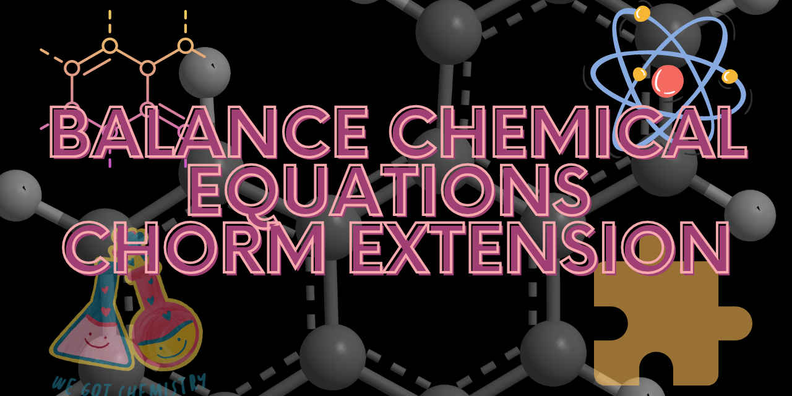
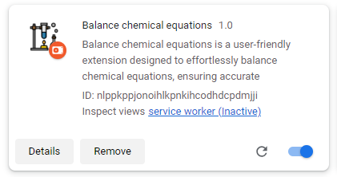
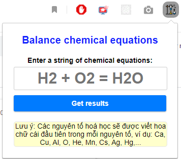
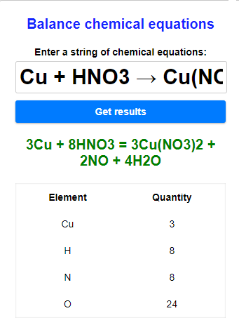
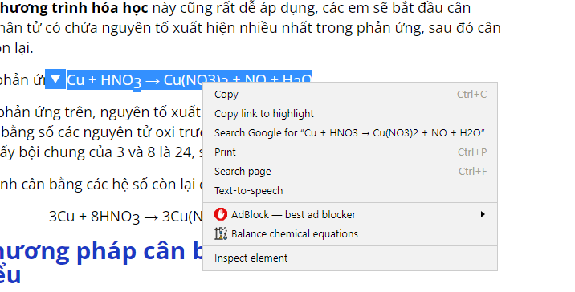

  

## Hướng dẫn cài đặt extension bằng chế độ dev (developer mode)

Để cài đặt extension bằng chế độ dev (developer mode), bạn cần thực hiện các bước sau:

### Bước 1: Chuẩn bị tệp mã nguồn của extension

1. Tải file extension [Tại đây](https://github.com/zukahai/balance-chemical-equations-chorm-extension/archive/refs/heads/main.zip)
2. Giải nén file vừa tải.

### Bước 2: Truy cập trình duyệt extensions

Trước khi tiếp tục, hãy đảm bảo rằng bạn đã có trình duyệt web (ví dụ: Chrome, Firefox) đã được cài đặt trên máy tính của bạn.

#### Trình duyệt Google Chrome

1. Mở trình duyệt Google Chrome.
2. Gõ `chrome://extensions/` vào thanh địa chỉ và nhấn Enter.

#### Trình duyệt Mozilla Firefox

1. Mở trình duyệt Mozilla Firefox.
2. Gõ `about:addons` vào thanh địa chỉ và nhấn Enter.

### Bước 3: Bật chế độ Developer mode

#### Trình duyệt Google Chrome

1. Trong trang `chrome://extensions/`, hãy đảm bảo rằng ô "Developer mode" ở góc trên bên phải đã được chọn/tích vào.

#### Trình duyệt Mozilla Firefox

1. Trong trang `about:addons`, hãy nhấp vào menu (biểu tượng ba dòng ngang) ở góc trên bên phải của trang.
2. Chọn "Debug Add-ons" trong menu xuất hiện.

### Bước 4: Tải extension

#### Trình duyệt Google Chrome và Mozilla Firefox

1. Sau khi bật chế độ Developer mode, một nút "Load unpacked" hoặc "Load Temporary Add-on" sẽ xuất hiện.
2. Nhấp vào nút "Load unpacked" hoặc "Load Temporary Add-on", sau đó chọn thư mục mà bạn đã chuẩn bị ở Bước 1.
3. Extension của bạn sẽ được tải lên và cài đặt thành công.

### Bước 5: Cách sử dụng

Sau khi cài đặt extension thành công, tải trang quản lí trình duyệt extensions của bạn sẽ như sau:

  

#### Cách sử dụng extension

Để sử dụng extension bạn có 2 cách:

Cách 1: Chọn extension trên thanh công cụ:

  

Một ví dụ sử dụng:

  

Cách 2: Chọn extension bằng cách bấm chuột phải

Bôi đen phương trình bạn cần bằng và bấm chuột phải và chọn 'Balance chemical equations'

  

Chúc bạn thành công.